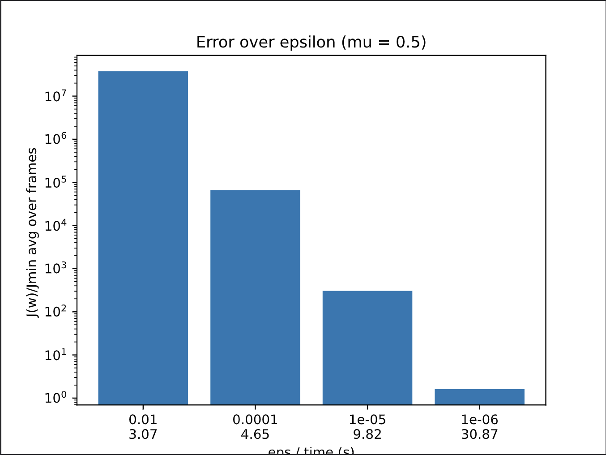

# LPC-based cross synthesis

This code implements a vocoder through cross-synthesis. LPC coefficients are computed in two ways: solving Wiener-Hopf equations and using the Steepest Descent algorithm.

## Getting Started
To use this code, run the `lpc.py` script. The `res` folder should contain `piano.wav` and `speech.wav`.

## Code Overview
The main function is `perform_lpc()`. 
- `Hanning` window and `overlap_factor = 0.5` are used for overlap and add.
- Global parameters can be changed to alter the script's behavior.
- Signal is divided into frames, windowed, and analyzed individually.
- LPC coefficients are computed, and whitening filter coefficients are obtained.
- Convolution is done through multiplication in frequency domain.
- Zero padding is overdone for artifact avoidance.
- The inverse FFTs are summed and written as `output.wav`.
- Data is normalized to prevent overflow errors in the Steepest Descent algorithm.

## Steepest Descent Analysis
The steepest descent is an iterative algorithm with two main parameters: 
- `mu`: step size to update the weights in the gradient direction
- `epsilon`: the smallest error reduction below which the algorithm is considered stationary and is stopped 

The `steepest_descent_analysis()` function performs this algorithm with varying `mu` and `epsilon` and evaluates the average error `J` (over all audio frames) reached at the final step. Results are shown in the following plots:

| | 
|--|
|
  

| 
  
 |

## Group
- Guglielmo Fratticioli
- Elia Pirrello
